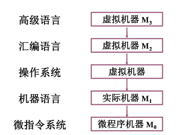
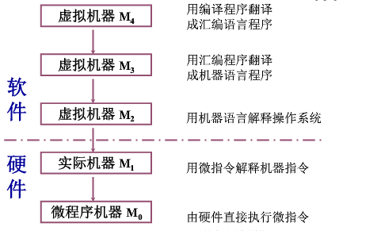

# 计算机系统概论
* 系统复杂性管理的方法
    1. 抽象
    2. 3Y
        - 层次化 Hierachy
            * 将被设计的系统划分为多个模块或子模块
        - 模块化 Modularity
            * 有明确定义的功能和接口
        - 规则性
            * 模块更容易被重用
## 计算机系统简介
- 计算机系统的软硬件概念
  * 计算机系统
    - 硬件 计算机的实体 如主机、外设等
    - 软件 由具有各类特殊功能的信息（程序）组成
        * 系统软件
        * 应用软件

- 计算机系统的层次结构

    

    

- 计算机组成与计算机体系结构从研究内容上来说有什么区别？

    * 计算机体系结构
        * 程序员所见到的计算机系统的属性概念性的结构与功能特性
            - 指令系统
            - 数据类型
            - 寻址技术
            - I/O 机理
    * 计算机组成
        * 实现计算机体系结构所体现的属性
            * 具体指令的实现

## 计算机的基本组成
- 冯·诺依曼计算机的特点
    * 由五大部件组成
        - 运算器
        - 控制器
        - 存储器
        - 输入设备
        - 输出设备
    * 指令和数据以同等地位存于存储器
        - 可按地址寻访
    * 指令和数据用二进制表示
    * 指令由操作码和地址码组成
    * 存储程序（核心特征）
    * 以运算器为中心

- 计算机硬件框图

- 一个现实中的问题，如何用计算机来解决？
- 是不是所有的问题都可以用计算的方法来解决

- 计算机的工作步骤
    1. 上机前的准备
        * 建立数学模型
        * 确定计算方法
        * 编制解题程序
            * 程序  运算的全部步骤
            * 指令  每一个步骤
