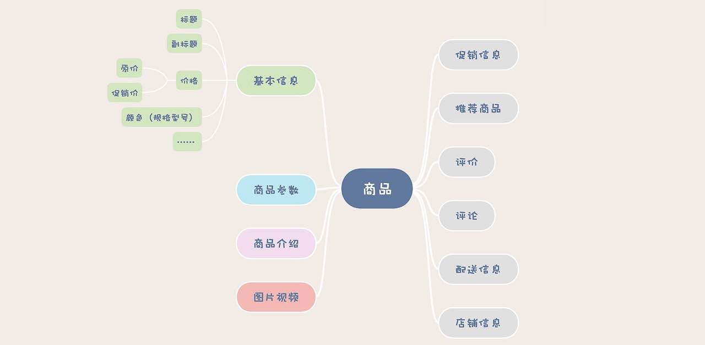
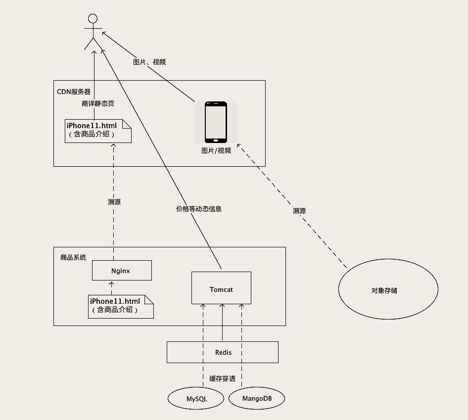

# 商品系统
- 主要功能：增删改查商品信息
- 支持的主要页面就是商品详情页
- 需要考虑
  * 高并发问题
  * 商品数据规模的问题
    * 数据量多，重量大 

# 需要保存哪些数据

- 左边的是商品系统需要存储的
- 分而治之
  * 商品基本信息
  * 商品参数
  * 图片视频
  * 商品介绍

# 商品基本信息如何存储
- 数据库中建一张表存储
- 数据库前加一个缓存
- 保留商品数据的每一个历史版本

## 缓存策略
- Cache Aside
  * 无特殊情况，首先考虑这种
- Read/Write Through
- Write Behind

# 使用MongoDB保存商品参数
- 数据量大、数据结构不统一，MongoDB很合适

# 使用对象存储保存图片和视频
- 数据库中只保存图片视频的id或URL
- 实际的图片视频以文件方式单独存储
- 首选方式是保存在对象存储（Object Storage）中
- 云服务厂商
  * 七牛
  * AWS的s3
- 开源对象存储：MinIO

# 将商品介绍静态化
- 比重最大
- 一般都是随着商品详情页一起静态化，保存在HTML文件中
- 节省服务器资源
- 利用CDN加速
- 商品价格、促销信息等需要频繁变动的信息，可在前端请求商品系统动态获取

# 总结

# 思考
- 用户下单正好赶上商品调价，商品详情页看到的价格和下单后的价格不一致