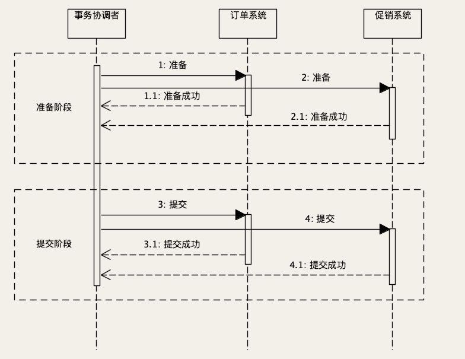
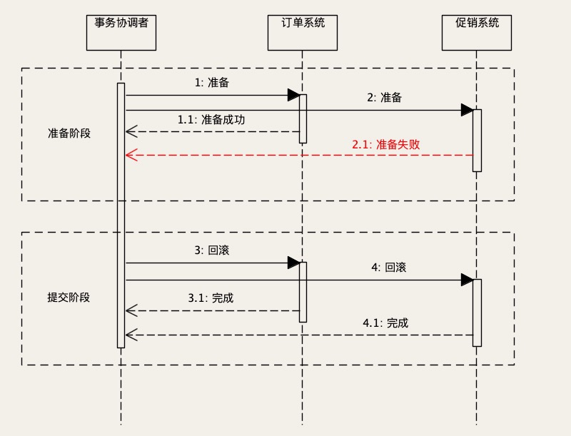

# 分布式事务的解决方案
- 2PC
- 3PC
- TCC
- Saga
- 本地消息表

# 2PC：订单与优惠券的数据一致性问题
- 2PC：二阶段提交
- 订单系统需要
  * 在“订单优惠券表”中写入订单关联的优惠券数据
  * 在“订单表”中写入订单数据
  
- 促销系统
  * 把已使用的优惠券张婷更新为“已使用”
  
- 如何用2PC解决
  * 引入事务协调者角色，协调订单系统和促销系统
  * 准备阶段
     * 协调者分别给订单系统和促销系统发送准备命令
     * 订单系统和促销系统收到命令之后开始执行准备操作（除提交数据库事务之外的所有工作）
     
  * 提交阶段
     * 协调者给两个系统发送“提交”命令
     * 每个系统提交自己的数据库事务，然后给协调者返回“提交成功”响应
     * 协调者收到所有响应之后，给客户端返回成功响应
- 异常情况
  * 准备阶段任何一部出现错误或者超市，协调者给两个系统发送“回滚事务”请求，每个系统收到后回滚自己的数据库事务
  * 准备阶段成功，进入提交阶段。整个分布式事务只能成功不能失败。如发生网络传输失败需反复重试，直到提交成功为止
- 时序图
  
  

- 事务协调服务
  * 没必要单独启动
  * 最好和订单服务或优惠券服务放在同一个进程里
  
  * 好处
     * 参与分布式事务的进程更少，故障点也就更少，稳定性更好
     * 减少了一些远程调用，性能也更好
     

- 2PC优缺点
  * 优点：适合对数据一致性要求高的场景
  * 缺点：事务的执行过程需要阻塞服务端的线程和数据库的会话。高并发场景下性能不高。协调者是一个单点，一旦过程中协调者宕机就会导致订单库或者促销库的事务会话一直卡在等待提交阶段，直到事务超时自动回滚
  
- 适用场景
  * 需要强一致性
  * 并发量不大

# 本地消息表：订单与购物车的数据一致性问题
- 点击去结算按钮系统做的两件事
  * 订单系统创建新订单，关联商品就是购物车中选择的商品
  * 创建订单成功后，购物车系统需要把订单中的商品从购物车中删除
- 清空购物车操作对一致性要求没有扣减优惠券高
- 只要保证经过一个小的延迟时间后，最终订单数据和购物车保持一致
- 本地消息表实现思路
  * 订单服务收到下单请求后，正常使用订单库的事务去更新订单的数据
  * 在执行数据库事务过程中，本地记录一条消息
  * 这个消息就是一个日志，内容就是情况购物车操作
  * 日志记录在本地，没有分布式问题，就是一个普通的单机事务，可以让订单库的事务来保证记录本地消息和订单库的一致性
  * 完成后给客户端返回成功响应
  * 再用一个异步服务去读取本地消息，调用购物车系统的服务清空购物车
  * 购物车清空之后，把本地消息的状态更新成已完成
  * 异步清空购物车过程中失败了，可通过重试解决
  * 最终可以保证订单系统和购物车系统的数据是一致的
- 本地消息表
  * 文件形式，保存在订单服务所在服务器的本地磁盘中
  * 订单库中
  * 消息队列RocketMQ 事务消息

- 优缺点：
  * 缺点：本地消息表只能满足D，A、C、I都比较差
  * 优点
     * 实现简单，单机事务的基础上稍加改造就可以实现分布式事务
     * 性能非常好，和单机事务的性能几乎没有差别，还提供了大部分情况下都能接受的数据最终一致性

# 思考题
- 3PC、TCC

# 上节思考
- RC和RR在并发更新数据时都需要对数据加锁（一般是行锁）
- 二个事务同事更新一条记录时，先更新的事务会抢占锁，在它结束事务之前，其他需要更新这条记录的事务都会卡住等待这个锁
     
- 这点两种隔离级别是一样的
            