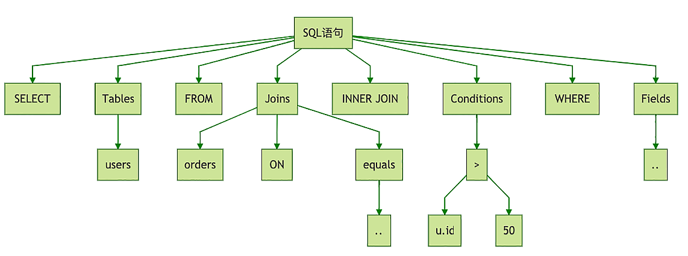

```SQL
SELECT * FROM user WHERE left(department_code, 5) = '00028';
SELECT * FROM user WHERE department_code LIKE '00028%';
```
第一天 SQL 的 WHERE 条件中对 department_code 这个列做了一个 left 截取的计算，对于表中的每一条数据，都得先做截取计算，然后判断截取后的值，所以不得不做全表扫描。你在写 SQL 的时候，尽量不要在 WEHER 条件中，对列做任何计算。

# 数据库服务端
- 执行器 Execution Engine
- 存储引擎 Storage Engine


# SQL 是如何在执行器中执行的
```SQL
SELECT u.id AS user_id, u.name AS user_name, o.id AS order_id
FROM users u INNER JOIN orders o ON u.id = o.user_id
WHERE u.id > 50
```
- 数据库收到查询请求后，需要先解析 SQL 语句，把这一串文本解析成便于程序处理的结构化数据(AST)，这就是一个通用的语法解析过程。



- 执行器解析这个 AST 之后，会生成一个逻辑执行计划。
  * 所谓的执行计划，可以简单理解为如何一步一步地执行查询和计算，最终得到执行结果的一个分步骤的计划。
  
```

LogicalProject(user_id=[$0], user_name=[$1], order_id=[$5])
    LogicalFilter(condition=[$0 > 50])
        LogicalJoin(condition=[$0 == $6], joinType=[inner])
            LogicalTableScan(table=[users])
            LogicalTableScan(table=[orders])
```
- 最内层的 2 个 LogicalTableScan 的含义是，把 USERS 和 ORDERS 这两个表的数据都读出来。
- 然后拿这两个表所有数据做一个 LogicalJoin，JOIN 的条件就是第 0 列 (u.id) 等于第 6 列 (o.user_id)。
- 然后再执行一个 LogicalFilter 过滤器，过滤条件是第 0 列 (u.id) 大于 50。
- 最后，做一个 LogicalProject 投影，只保留第 0(user_id)、1(user_name)、5(order_id) 三列。这里“投影 (Project)”的意思是，把不需要的列过滤掉。
- 对执行计划进行优
  * 优化的总体思路是，在执行计划中，尽早地减少必须处理的数据量。也就是说，尽量在执行计划的最内层减少需要处理的数据量。
  
```

LogicalProject(user_id=[$0], user_name=[$1], order_id=[$5])
    LogicalJoin(condition=[$0 == $6], joinType=[inner])
        LogicalProject(id=[$0], name=[$1])              // 尽早执行投影
            LogicalFilter(condition=[$0 > 50])          // 尽早执行过滤
                LogicalTableScan(table=[users])
        LogicalProject(id=[$0], user_id=[$1])           // 尽早执行投影
            LogicalTableScan(table=[orders])
```
- 尽早地执行投影，去除不需要的列；
- 尽早地执行数据过滤，去除不需要的行。


# SQL 是如何在存储引擎中执行的？
- InnoDB
  * 数据表的物理存储结构是以主键为关键字的 B+ 树，每一行数据直接就保存在 B+ 树的叶子节点上。
  * 表的索引也是以 B+ 树的方式来存储的，和存储数据的 B+ 树的区别是，在索引树中，叶子节点保存的不是行数据，而是行的主键值。
  
  
  
- 优化后的逻辑执行计划将会被转换成物理执行计划
```
InnodbProject(user_id=[$0], user_name=[$1], order_id=[$5])
    InnodbJoin(condition=[$0 == $6], joinType=[inner])
        InnodbTreeNodesProject(id=[key], name=[data[1]])
            InnodbFilter(condition=[key > 50])
                InnodbTreeScanAll(tree=[users])
        InnodbTreeNodesProject(id=[key], user_id=[data[1]])
            InnodbTreeScanAll(tree=[orders])
```
- 物理执行计划同样可以根据数据的物理存储结构、是否存在索引以及数据多少等各种因素进行优化。这一块儿的优化规则同样是非常复杂的
  * 比如，我们可以把对用户树的全树扫描再按照主键过滤这两个步骤，优化为对树的范围查找。
  
  
```
PhysicalProject(user_id=[$0], user_name=[$1], order_id=[$5])
    PhysicalJoin(condition=[$0 == $6], joinType=[inner])
        InnodbTreeNodesProject(id=[key], name=[data[1]])
            InnodbTreeRangeScan(tree=[users], range=[key > 50])  // 全树扫描再按照主键过滤，直接可以优化为对树的范围查找
        InnodbTreeNodesProject(id=[key], user_id=[data[1]])
            InnodbTreeScanAll(tree=[orders])
```
- 最终，按照优化后的物理执行计划，一步一步地去执行查找和计算，就可以得到 SQL 的查询结果了。


- 比如，我们知道了 InnoDB 的索引实现后，就很容易明白为什么主键不能太长，因为表的每个索引保存的都是主键的值，过长的主键会导致每一个索引都很大。
- 再比如，我们了解了执行计划的优化过程后，就很容易理解，有的时候明明有索引却不能命中的原因是，数据库在对物理执行计划优化的时候，评估发现不走索引，直接全表扫描是更优的选择。


# 小结
- 一条 SQL 在数据库中执行，首先 SQL 经过语法解析成 AST，然后 AST 转换为逻辑执行计划，逻辑执行计划经过优化后，转换为物理执行计划，再经过物理执行计划优化后，按照优化后的物理执行计划执行完成数据的查询。几乎所有的数据库，都是由执行器和存储引擎两部分组成，执行器负责执行计算，存储引擎负责保存数据。