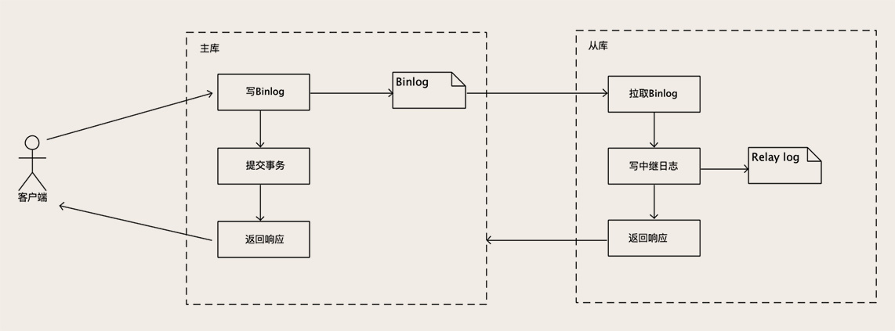

# 如何配置 MySQL 的主从同步？
- 当客户端提交一个事务到 MySQL 的集群，直到客户端收到集群返回成功响应，在这个过程中，MySQL 集群需要执行很多操作：
  * 主库需要提交事务、更新存储引擎中的数据、把 Binlog 写到磁盘上、给客户端返回响应、把 Binlog 复制到所有从库上
  * 每个从库需要把复制过来的 Binlog 写到暂存日志中、回放这个 Binlog、更新存储引擎中的数据、给主库返回复制成功的响应。
  
- MySQL 提供了几个参数来配置这个时序
  * 默认情况下，MySQL 采用异步复制的方式，执行事务操作的线程不会等复制 Binlog 的线程
  * 提交事务和复制这两个流程在不同的线程中执行，互相不会等待，这是异步复制。
  * 异步复制它没有办法保证数据能第一时间复制到从库上。
  * 同步复制这种方式在实际项目中，基本上没法用，原因有两个：一是性能很差，因为要复制到所有节点才返回响应；二是可用性也很差，主库和所有从库任何一个数据库出问题，都会影响业务。
  * MySQL 从 5.7 版本开始，增加一种半同步复制（Semisynchronous Replication）的方式。异步复制是，事务线程完全不等复制响应；同步复制是，事务线程要等待所有的复制响应；半同步复制介于二者之间，事务线程不用等着所有的复制成功响应，只要一部分复制响应回来之后，就可以给客户端返回了。

- 半同步复制注意事项
 *  配置半同步复制的时候，有一个重要的参数“rpl_semi_sync_master_wait_no_slave”，含义是：“至少等待数据复制到几个从节点再返回”。这个数量配置的越大，丢数据的风险越小，但是集群的性能和可用性就越差。最大可以配置成和从节点的数量一样，这样就变成了同步复制。一般配置成默认值1
 *  “rpl_semi_sync_master_wait_point”，这个参数控制主库执行事务的线程，是在提交事务之前（AFTER_SYNC）等待复制，还是在提交事务之后（AFTER_COMMIT）等待复制。默认是 AFTER_SYNC，也就是先等待复制，再提交事务，这样完全不会丢数据。AFTER_COMMIT 具有更好的性能，不会长时间锁表，但还是存在宕机丢数据的风险。
 *  如果说，主库提交事务的线程等待复制的时间超时了，这种情况下事务仍然会被正常提交。并且，MySQL 会自动降级为异步复制模式，直到有足够多（rpl_semi_sync_master_wait_no_slave）的从库追上主库，才能恢复成半同步复制。如果这个期间主库宕机，仍然存在丢数据的风险。
 

# 复制状态机：所有分布式存储都是这么复制数据的
- 基于“快照 + 操作日志”的方法，不是 MySQL 特有的。
  * Redis Cluster 中，它的全量备份称为 Snapshot，操作日志叫 backlog，它的主从复制方式几乎和 MySQL 是一模一样的。
  
- 理论基础
  * 复制状态机 (Replication State Machine)
  * [《The Implementation of Reliable Distributed Multiprocess Systems》](http://lamport.azurewebsites.net/pubs/implementation.pdf)