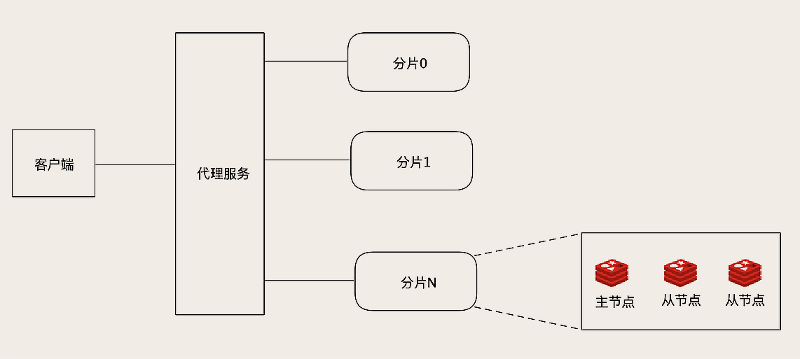
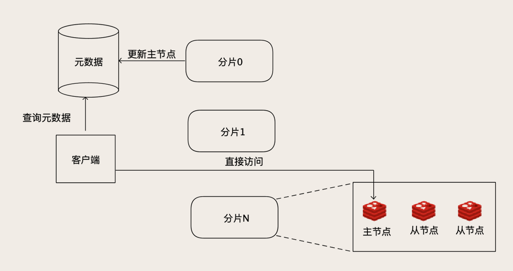

# 以 MySQL 为例子，如何应对海量数据，如何应对高并发，如何实现高可用
- 数据量太大查询慢怎么办？
  * 存档历史数据或者分库分表，这是数据分片。
- 并发太高扛不住怎么办？
  * 读写分离，这是增加实例数
- 数据库宕机怎么办？
  * 增加从节点，主节点宕机的时候用从节点顶上，这是主从复制。
  * 要特别注意数据一致性的问题。  
  

# Redis Cluster 如何解决数据量大、高可用和高并发问题？
- Redis 从 3.0 版本开始，提供了官方的集群支持，也就是 Redis Cluser。
- Redis Cluster 相比于单个节点的 Redis，能保存更多的数据，支持更多的并发，并且可以做到高可用，在单个节点故障的情况下，继续提供服务。
- 为了能够保存更多的数据，和 MySQL 分库分表的方式类似，Redis Cluster 也是通过分片的方式，把数据分布到集群的多个节点上。
- Redis Cluster 是如何来分片的呢？
  * 它引入了一个“槽（Slot）”的概念，这个槽就是哈希表中的哈希槽，槽是 Redis 分片的基本单位，每个槽里面包含一些 Key。
  * 每个集群的槽数是固定的 16384（16 * 1024）个
  * 每个 Key落在哪个槽中也是固定的，计算方法是：`HASH_SLOT = CRC16(key) mod 16384`
  
- 这些槽又是如何存放到具体的 Redis 节点上的呢？
  * 这个映射关系保存在集群的每个 Redis 节点上
  * 集群初始化的时候，Redis 会自动平均分配这 16384 个槽，也可以通过命令来调整。
  * 这个分槽的方法，也是我们上节课讲到过的分片算法：查表法。
  
- 客户端可以连接集群的任意一个节点来访问集群的数据，当客户端请求一个 Key 的时候，被请求的那个 Redis 实例先通过上面的公式，计算出这个 Key 在哪个槽中，然后再查询槽和节点的映射关系，找到数据所在的真正节点，如果这个节点正好是自己，那就直接执行命令返回结果。如果数据不在当前这个节点上，那就给客户端返回一个重定向的命令，告诉客户端，应该去连哪个节点上请求这个 Key 的数据。然后客户端会再连接正确的节点来访问。
- 解决分片问题之后，Redis Cluster 就可以通过水平扩容来增加集群的存储容量，但是，每次往集群增加节点的时候，需要从集群的那些老节点中，搬运一些槽到新节点，你可以手动指定哪些槽迁移到新节点上，也可以利用官方提供的redis-trib.rb脚本来自动重新分配槽，自动迁移。
- 分片可以解决 Redis 保存海量数据的问题，并且客观上提升了 Redis 的并发能力和查询性能。但是并不能解决高可用的问题，每个节点都保存了整个集群数据的一个子集，任何一个节点宕机，都会导致这个宕机节点上的那部分数据无法访问。
- Redis Cluster 是怎么解决高可用问题的？
  * 增加从节点，做主从复制。
  * Redis Cluster 支持给每个分片增加一个或多个从节点，每个从节点在连接到主节点上之后，会先给主节点发送一个 SYNC 命令，请求一次全量复制，也就是把主节点上全部的数据都复制到从节点上。全量复制完成之后，进入同步阶段，主节点会把刚刚全量复制期间收到的命令，以及后续收到的命令持续地转发给从节点。
  * 因为 Redis 不支持事务，所以它的复制相比 MySQL 更简单，连 Binlog 都省了，直接就是转发客户端发来的更新数据命令来实现主从同步。如果某个分片的主节点宕机了，集群中的其他节点会在这个分片的从节点中选出一个新的节点作为主节点继续提供服务。新的主节点选举出来后，集群中的所有节点都会感知到，这样，如果客户端的请求 Key 落在故障分片上，就会被重定向到新的主节点上。
  

# 为什么 Redis Cluster 不适合超大规模集群？
- Redis Cluster 的优点是易于使用。分片、主从复制、弹性扩容这些功能都可以做到自动化，通过简单的部署就可以获得一个大容量、高可靠、高可用的 Redis 集群，并且对于应用来说，近乎于是透明的。
- 但是 Redis Cluster 不太适合构建超大规模集群，主要原因是，它采用了去中心化的设计。
- Redis Cluster 采用了一种去中心化的流言 (Gossip) 协议来传播集群配置的变化。
- 传播速度慢，并且是集群规模越大，传播的越慢。

# 如何用 Redis 构建超大规模集群？
- 一种是基于代理的方式，在客户端和 Redis 节点之间，还需要增加一层代理服务。这个代理服务有三个作用。
  * 第一个作用是，负责在客户端和 Redis 节点之间转发请求和响应。客户端只和代理服务打交道，代理收到客户端的请求之后，再转发到对应的 Redis 节点上，节点返回的响应再经由代理转发返回给客户端。
  * 第二个作用是，负责监控集群中所有 Redis 节点状态，如果发现有问题节点，及时进行主从切换。
  * 第三个作用就是维护集群的元数据，这个元数据主要就是集群所有节点的主从信息，以及槽和节点关系映射表。这个架构和我在《12 | MySQL 如何应对高并发（二）：读写分离》这节课中给你讲过的，用 HAProxy+Keepalived 来代理 MySQL 请求的架构是类似的，只是多了一个自动分片路由的功能而已。
  
  * 开源的 Redis 集群方案twemproxy和Codis，都是这种架构的。
  
- 另外一种方式是，不用这个代理服务，把代理服务的寻址功能前移到客户端中去。客户端在发起请求之前，先去查询元数据，就可以知道要访问的是哪个分片和哪个节点，然后直连对应的 Redis 节点访问数据。

# 小结
今天这节课我们讲了从小到大三种构建 Redis 集群的方式。

小规模的集群建议使用官方的 Redis Cluster，在节点数量不多的情况下，各方面表现都不错。

再大一些规模的集群，可以考虑使用 twemproxy 或者 Codis 这类的基于代理的集群架构，虽然是开源方案，但是已经被很多公司在生产环境中验证过。

相比于代理方案，使用定制客户端的方案性能更好，很多大厂采用的都是类似的架构。

还有一个小问题需要注意的是，这几种集群方案对一些类似于“KEYS”这类的多 KEY 命令，都没法做到百分百支持。原因很简单，数据被分片了之后，这种多 KEY 的命令很可能需要跨多个分片查询。当你的系统从单个 Redis 库升级到集群时，可能需要考虑一下这方面的兼容性问题。