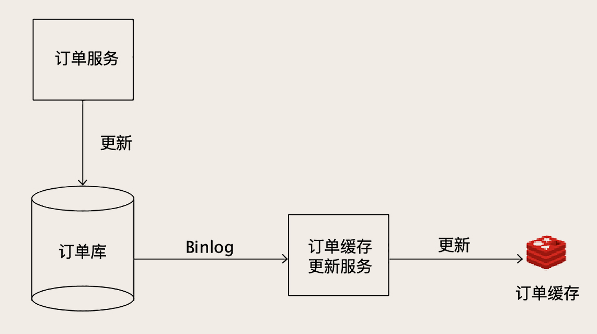

# 缓存穿透：超大规模系统的不能承受之痛
- 对于像订单服务这类核心的业务，一个可行的方法是，我们启动一个更新订单缓存的服务，接收订单变更的 MQ 消息，然后更新 Redis 中缓存的订单数据。
  * 必须保证整个消息链条的可靠性，不过好在现在的 MQ 集群，比如像 Kafka 或者 RocketMQ，它都有高可用和高可靠的保证机制，只要你正确配置好，是可以满足数据可靠性要求的。
  

# 使用 Binlog 实时更新 Redis 缓存
- 负责更新缓存的服务，把自己伪装成一个 MySQL 的从节点，从 MySQL 接收 Binlog，解析 Binlog 之后，可以得到实时的数据变更信息，然后根据这个变更信息去更新 Redis 缓存。

- 这个方案唯一的缺点是，实现订单缓存更新服务有点儿复杂，毕竟不像收消息，拿到的直接就是订单数据，解析 Binlog 还是挺麻烦的。
- 有很多开源的项目就提供了订阅和解析 MySQL Binlog 的功能，如Canal